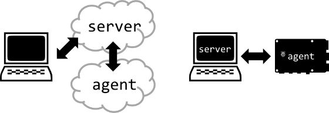

# [atet](https://github.com/atet) / [**_kube_**](https://github.com/atet/kube/blob/main/README.md#atet--kube)

<p align="center">
</br><font style="font-size: 50px"><b>kubernetes</b></font></p>

# Container Orchestration with Kubernetes

This tutorial will get you up and running with a Kubernetes cluster in less than 10 mins. You must have SSH access to at least two cloud instances (AWS, Digital Ocean, etc.) or on-premises computers (e.g., a laptop and a Raspberry Pi on the same network) to successfully get through these instructions.

----------------------------------------------------------------------------

## Table of Contents

* [0. Requirements](#0-requirements)
* [1. Introduction](#1-introduction)
* [2. Installation](#2-installation)
* [3. Basic Examples](#3-basic-examples)
* [4. Next Steps](#4-next-steps)

### Supplemental

* [Other Resources](#other-resources)
* [Troubleshooting](#troubleshooting)

----------------------------------------------------------------------------

## 0. Requirements

You must have access to at least two cloud or on-premises resources that are networked together and can communicate through a LAN or public internet. 

Minimum requirments per resource node:
- One CPU core
- One GB RAM (**512 MB of RAM is not enough**) 
- Ubuntu 24.04 (LTS) x64

[Back to Top](#table-of-contents)

----------------------------------------------------------------------------

## 1. Introduction

We will be using the "k3s" certified Kubernetes distribution by Rancher. It is a lighter-weight version of the more fully-featured Kubernetes "k8s" originally designed by Google.

The k3s version is meant to be used by resource-constrained hardware like ARM single-board computers with more limited RAM (e.g., a Raspberry Pi). Another big advantage is this smaller software distribution is much easier to install.

The overall architecture of what we are building is a cluster of two nodes, a single **server** controller for a single **agent** worker node. If you are adventurous, you can add more agent nodes or even another server for redundancy.

Below are examples of our tutorial setup, whether you are using a laptop connected to a cloud instance server that has one agent (left) or a laptop, as the server, connected to a Raspberry Pi agent (right):

[](#nolink)

[Back to Top](#table-of-contents)

----------------------------------------------------------------------------

## 2. Installation

Here, we will first install the k3s software on the server node, then configure the server, and lastly install the k3s software on the agent node.

### Server Node

1. To have Kubernetes work correctly, all resources must have swap diabled and comment any line regarding swap in `/etc/fstab`:

```bash
$ swapoff -a
$ nano /etc/fstab
```

2. Update everything, reboot, wait a minute, and **log back on**:

```bash
$ apt update && apt -y upgrade && reboot
```

3. Install k3s and wait until it finishes with "`Starting k3s`":

```bash
$ curl -sfL https://get.k3s.io | sudo bash -
.
.
.
[INFO]  systemd: Starting k3s
```

4. Check that the k3s service is running (press '`q`' to quit):

```bash
$ systemctl status k3s.service
```

5. Copy configuration and add environmental variable:

```bash
$ mkdir ~/.kube && \
  cp /etc/rancher/k3s/k3s.yaml ~/.kube/config && \
  chown $USER:$USER  ~/.kube/config && \
  echo -e "\nexport KUBECONFIG=~/.kube/config" | tee -a ~/.bashrc && \
  source ~/.bashrc
```

6. Print and copy the server's k3s token, which is needed for the agent node (example below):

```bash
$ cat /var/lib/rancher/k3s/server/node-token

1234567890123456789012345678901234567890123456789012345678901234567::server:89012345678901234567890123456789
```

7. Get the server's public (if using cloud) or local IP address (if using LAN):

```bash
$ ip ad
.
.
.
2: eth0: <BROADCAST,MULTICAST,UP,LOWER_UP> mtu 1500 qdisc pfifo_fast state UP group default qlen 1000
    link/ether 01:12:34:67:89:0a brd ff:ff:ff:ff:ff:ff
    altname enp0s3
    altname ens3
    inet 123.456.789.1/20 brd 123.456.789.255 scope global eth0
.
.
.
```

### Agent Node

8. Comment any line regarding swap in `/etc/fstab`, disable swap, update everything, reboot, wait a minute, and **log back on**:

```bash
$ nano /etc/fstab
$ swapoff -a && apt update && apt -y upgrade && reboot
```

9. Install k3s with the server's token and IP address:
```
$ ControlIP="123.456.789.1" && \
  ControlTOKEN="1234567890123456789012345678901234567890123456789012345678901234567::server:89012345678901234567890123456789" && \
  curl -sfL https://get.k3s.io | sudo K3S_URL=https://$ControlIP:6443 K3S_TOKEN=$ControlTOKEN sh -
```

Congratulations! You now have Kubernetes cluster set up on a server and agent node. In the next section, we will now test this cluster out with a web server.

[Back to Top](#table-of-contents)

----------------------------------------------------------------------------

## 3. Basic Examples

BASIC EXAMPLES.

[Back to Top](#table-of-contents)

----------------------------------------------------------------------------

## 4. Next Steps

NEXT STEPS.

[Back to Top](#table-of-contents)

----------------------------------------------------------------------------

## Other Resources

**Description** | **URL Link**
--- | ---
null | null

[Back to Top](#table-of-contents)

----------------------------------------------------------------------------

## Troubleshooting

Issue | Solution
--- | ---
**"It's not working!"** | This concise tutorial has distilled hours of sweat, tears, and troubleshooting; _it can't not work_

[Back to Top](#table-of-contents)

----------------------------------------------------------------------------

<p align="center">Copyright © 2024-∞ Athit Kao, <a href="http://www.athitkao.com/tos.html" target="_blank">Terms and Conditions</a></p>